```{r setup, include=FALSE}
knitr::opts_chunk$set(echo = TRUE)
```

```{r}
library(dplyr)
library(lmtest)
library(plotly)
library(ResourceSelection)
library(car)
library(ROCR)
library(MASS)
library(tidyr)
```

age: Edad del paciente en años
surgtype: Tipo de cirugía (1= Orthopedic, 2= Gynecological, 3= Abdominal) 
blocking: Agente bloqueante neuromuscular (1= Pancuronium (P), 2= Vecuronium (V), 3= Atracurium (A)) 
longact: Agente blanqueante neuromuscular codificado en función de la actividad a largo plazo (0= No (V,A), 1= Si (P), (ver codificación de la variable anterior)
duration: Duración de la operación en minutos 
tofratio: La razón T4/T1 en un test de estimulación train − of − four (TOF)
Y =complicación: 0: No, 1: Si.


```{r}
df<- read.table("surgery.txt")
df$surgtype = factor(df$surgtype, labels = c("Orthopedic","Gynecological", "Abdominal"))
df$blocking = factor(df$blocking, labels = c("Pancuronium","Vecuronium", "Atracurium"))
df$longact = factor(df$longact, labels = c("No","Si"))
df$complication = factor(df$complication, labels = c("No","Si"))
names(df) <- c("A","S","NBA","long-act","D","RNB","Y")
summary(df)
```

```{r}
str(df)
```
```{r}
df <- df %>% mutate(A60 = case_when(A >= 60 ~ '1', A < 60 ~ '0'))
```

Recuerde el ejemplo 1.4 de la sección 1.1 en el que participaron 691 pacientes sometidas a cirugía Orthopedic, Gynecological o Abdominal. El propósito del estudio fue determinar si algunos tipos de agentes bloqueadores neuromusculares (NBA) eran más propensos a complicaciones pulmonares posquirúrgicas que otros. Además, era de interés saber si el bloqueo neuromuscular residual (RNB, medido por algunas pruebas clínicas después de la operación, pero aquí indicado por una medida de función neuromuscular llamada TOF-ratio) era un factor de riesgo de complicaciones, y en particular así para el Pancuronium (que, por cierto, es el único fármaco de acción prolongada entre los tres). 

El resultdo de interés es la variable binaria.

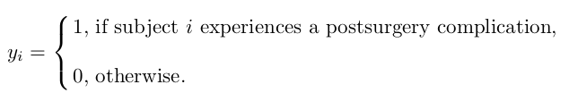
El número de complicaciones (los recuentos reales y el porcentaje del grupo correspondiente) para cada uno de los tres grupos de agentes neuromusculares aparecen en la tabla 6.2.8.

#Tabla 6.2.8. Complicaciones en relación al tipo de bloqueante neuromuscular (NBA).
```{r}
df %>%
  group_by (NBA, Y) %>%
  summarise (n=n()) %>%
  mutate("%" = paste0(round(100 * n/sum(n), 0), "%")) %>% filter(Y == "Si")
```
Según esta tabla, los tres agentes parecen tener riesgos bastante similares de complicaciones posoperatorias, quizás con un riesgo ligeramente mayor de Pancuronium.


El estudio se realizó como un estudio aleatorizado en bloques con los grupos de cirugía como bloques. Esto significa que los pacientes de cada grupo de cirugía fueron asignados al azar para recibir uno de los tres agentes bloqueadores neuromusculares (Pa, At o Ve). En principio, por lo tanto, no debería haber relación entre el tipo de cirugía y el agente bloqueante y una inferencia válida para evaluar el efecto del NBA es seguir la discusión de la Sección 3.2.2 y hacer una comparación simple de las tres probabilidades estimadas de la Tabla 6.2.8. 
Esto da como resultado un estadístico de prueba de chi-cuadrado de 1,466, que bajo la hipótesis de que no hay diferencia entre los tres agentes bloqueadores neuromusculares se distribuye como χ2(2), lo que da $P = 0,48$, es decir, ninguna diferencia detectable. 
Sin embargo, debido a los abandonos, existe una pequeña diferencia en la distribución de NBA en los tres grupos de cirugía, como se ve en la Tabla 6.2.9. Por lo tanto, podemos ver una ligera confusión del tipo de cirugía sobre el efecto de NBA porque sabemos por las Secciones 3.1.2 y 3.2.2 que el tipo de cirugía $(S)$ tiene un impacto claro en el riesgo de complicaciones $(Y)$ en el sentido que la cirugía Abdominal tiene un riesgo mayor de complicaciones que los otros dos grupos de cirugía.

Tabla 6.2.9. Número de pacientes según tipo de cirugía y agente neuromuscular.
```{r}
df %>% 
  group_by(S, NBA ) %>%
  count() %>% 
  ungroup()%>%
  spread(NBA, n)
```
También se sospecha que la edad (A) y la duración de la anestesia (D) también podrían afectar la probabilidad de una complicación. Otras variables que podrían entrar en consideración (pero que no se consideran aquí) incluyen el sexo, el estado de salud general del paciente, el peso, los hábitos de fumar y la temperatura corporal. 
Nuestro principal interés radica en el efecto del agente bloqueador neuromuscular (NBA) y el bloqueo neuromuscular residual (RNB) sobre el riesgo de complicaciones (Y), y debido a que es probable que NBA influya en la RNB, el diagrama inicialmente se verá así:

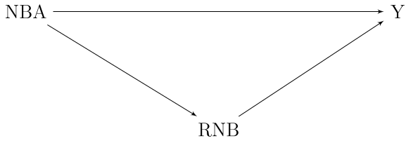

RNB es una variable intermedia para el efecto de NBA sobre el riesgo de complicación, por lo que no debe ser ingresada en el modelo cuando el objetivo sea evaluar el efecto de NBA. Por otro lado, incluir RNB en el modelo puede responder a nuestra segunda pregunta, a saber, si una diferencia entre los grupos NBA (si hubiera habido alguna) podría explicarse por un riesgo inducido de RNB. Ampliando el modelo con todas las covariables mencionadas hasta ahora, obtenemos el diagrama: 


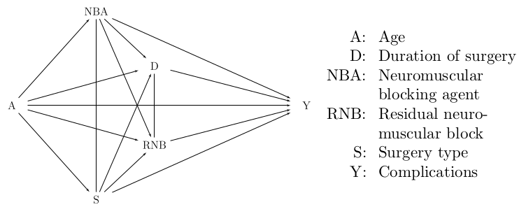


Para evaluar el efecto de NBA, debemos omitir las variables intermedias D y RNB, de modo que el modelo se convierta en el de la Figura 6.2.8. 

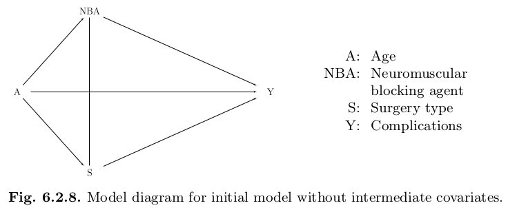
Debido a que el resultado es una variable binaria (complicación 0: no, 1: sí), modelamos la expectativa $E(y_0i) = pr(y_i = 1)$ usando el logit tradicional, como se explica en detalle en las Secciones 3.1.2 y 4.1.2. El predictor lineal en esta escala logit tiene que ser una función de las tres variables de la figura 6.2.8 (es decir, A, S y NBA). Las variables categóricas S y NBA tienen cada una tres niveles y sus efectos se modelan eligiendo una categoría de referencia y estimando la diferencia entre este nivel de referencia y los otros dos niveles. 

La variable edad (A) es una variable cuantitativa y debemos decidir cómo ingresarla en el predictor lineal. Es una creencia común que los pacientes mayores tienen un mayor riesgo de complicaciones, pero si este efecto es gradual (de modo que la edad podría modelarse como un efecto lineal) o si es solo un efecto visto por encima de algún umbral (como, por ejemplo, , 60 años, un umbral comúnmente elegido) queda por investigar. 
Por lo tanto, inicialmente elegimos el efecto de la edad como una spline lineal (es decir, una línea discontinua; consulte la Sección 4.2.1), con una ruptura a la edad de 60 años. Esto significa que la edad da lugar a dos covariables, a saber, la edad $x_i$ misma así como la variable definida por edad como: $x_i^+ = (age - 60) I (age > 60)$. 

Cuando estas dos covariables relacionadas con la edad se incluyen en un modelo para el riesgo de complicaciones, junto con las dos variables categóricas tipo de cirugía ($S$) y $NBA$, obtenemos los resultados presentados como Modelo 1 en la Tabla 6.2.10. Vemos que el efecto de un aumento de diez años en la edad antes de los 60 se estima como una razón de probabilidades de 1,78. Sin embargo, para las edades mayores de 60 años, un aumento de diez años solo da una razón de probabilidades estimada de 1,45. Por lo tanto, el componente adicional en la edad (correspondiente a la ruptura a la edad de 60 años) hace que la curva se doble en una dirección descendente algo inesperada, pero debido a que no es significativa (P = 0.58) estamos contentos con la elección inicial de la edad del modelo por un efecto lineal. Esto cambia nuestros resultados a los del Modelo 2 en 6.2.10. 
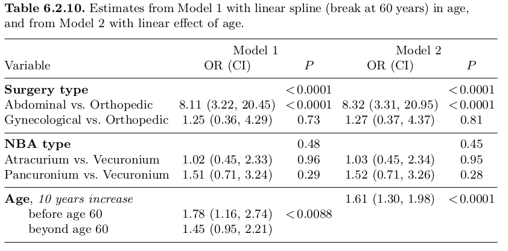

Vemos que tanto la edad como el tipo de cirugía son predictores muy significativos de la probabilidad de una complicación. Para los pacientes Abdominal, las probabilidades de una complicación se estiman entre seis y ocho veces más altas que para los otros dos grupos de cirugía, y los diez años de edad aumentan las probabilidades en más del 50%. Estos efectos están condicionados a que las otras dos covariables se mantengan fijas, pero independientemente del valor de estos valores fijos. Por ejemplo, el efecto de la edad se interpreta como la razón de probabilidades de complicación entre dos personas con una diferencia de edad de diez años que se han sometido al mismo tipo de cirugía (S) y el mismo tipo de agente bloqueador neuromuscular (NBA). No hemos incluido interacciones en el modelo, por lo tanto, se supone que esta razón de probabilidades es la lo mismo sin importar qué tipo de cirugía y qué agente bloqueador (NBA) estemos buscando. 

Bien podemos cuestionar tal suposición de que no hay interacción, en particular entre las dos covariables importantes, la edad y el tipo de cirugía. La Figura 6.2.9 muestra los residuos del Modelo 2 de la Tabla 6.2.10, graficados contra la edad y con un suavizador superpuesto para cada uno de los tres tipos de cirugía. Nos preocupa un posible patrón en estos residuos y si dicho patrón podría ser diferente en los tres grupos. 


La figura 6.2.9 no sugiere ningún patrón claro en la edad y tampoco sugiere que los efectos de la edad difieran de un grupo de cirugía a otro. Incluir una interacción entre la edad y el tipo de cirugía en nuestro modelo produce estimaciones separadas del efecto de la edad en los tres grupos de cirugía, como se muestra en la Tabla 6.2.11, e incluso si parecen ser bastante diferentes, esta diferencia no alcanza significación (P = 0,45), posiblemente porque tenemos muy pocas complicaciones observadas. Nótese que, en esta situación, se consideraría una expedición de pesca realizar un análisis de subgrupos e interpretar los significados formales en dos de los grupos de cirugía y el no significativo en el tercero. En realidad, de la Tabla 6.2.11 vemos que incluso si el efecto de la edad insignificante en el grupo ginecológico corresponde al efecto estimado más bajo entre los tres, el efecto de la edad altamente significativo en el grupo Abdominal solo se estima un poco más grande mientras que el límite es significativo El efecto en el grupo Orthopedic es, con mucho, el mayor de los tres. Esto tiene que ver con la distribución de edad entre los pacientes que experimentan complicaciones en los tres grupos. 

Aunque la interacción entre cirugía y edad no es significativa, esto no es lo mismo que decir que los efectos de la edad son necesariamente idénticos en los tres grupos. La razón es, por supuesto, que bien podríamos haber pasado por alto algo debido a un tamaño de muestra demasiado pequeño (un error de tipo II). Para decidir si es posible que se haya pasado por alto algo importante, tenemos quea la recurrirfigura 6.2.9. Diagrama de dispersión de residuos del modelo del panel derecho de la tabla 6.2.10 versus edad, con suavizadores superpuestos según el tipo de cirugía. 
observe las diferencias estimadas entre los efectos de la edad. Por ejemplo, se estima que la diferencia entre el efecto de la edad en el grupo Orthopedic y el grupo ginecológico es de 0,591 con una DE estimada de 0,539 (es decir, con el intervalo de confianza (–0,466, 1,647)). Esto significa que el efecto de la edad podría tener una razón de probabilidades de hasta un factor exp (1,647) = 5,19 más alto en el grupo Orthopedic en comparación con el grupo ginecológico. No estamos en condiciones de decidir si esto puede ser importante, pero parece una gran discrepancia posible que no se puede descartar. 

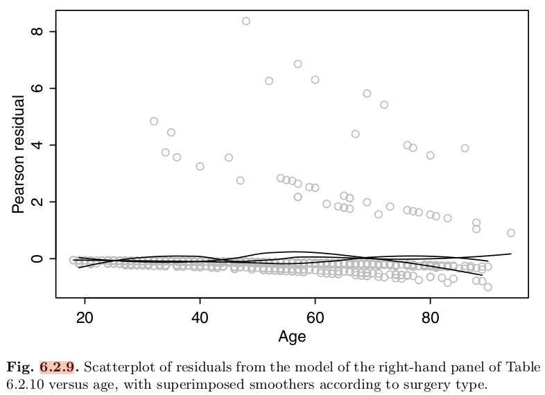

Tabla 6.2.11. Efectos de edad estimados para cada grupo de cirugía por separado, ajustados por NBA. 
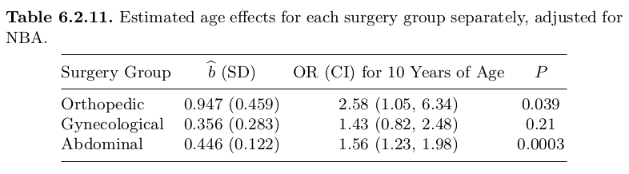

Dado que el objetivo principal de este estudio fue evaluar el desempeño de los tres NBA diferentes, es de interés primordial ver en qué medida esto se ve afectado por el modelado del efecto de la edad, especialmente porque hemos visto que no podemos sentir cierto acerca de la modelización deledad efecto debido a una cantidad insuficiente de datos. La tabla 6.2.12 resume las estimaciones de la razón de probabilidades entre los tres agentes bloqueadores neuromusculares para diferentes modelos y, afortunadamente, notamos una estimación muy estable de las diferencias entre los tres agentes bloqueadores. 

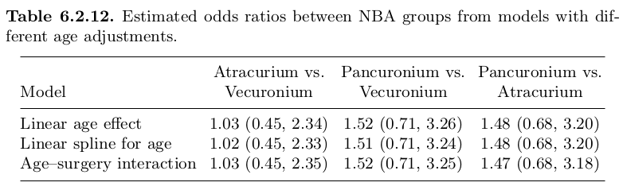
 
La tentadora conclusión parece ser que no hay diferencia entre los tres agentes bloqueadores neuromusculares. Sin embargo, como siempre, esta conclusión no debe tomarse únicamente sobre la base de una prueba de significancia, sino que siempre debe complementarse con una consideración cuidadosa de los intervalos de confianza de la Tabla 6.2.12. Si estos incluyen valores de interés (es decir, valores que habrían sido interesantes si en realidad fueran las verdaderas diferencias) nuestra conclusión debe ser que el estudio no es concluyente. Por ejemplo, la comparación entre Pancuronium y Atracurium incluye una razón de probabilidades de más de tres, lo que difícilmente puede considerarse un efecto pequeño. En esta situación, por lo tanto, la conclusión no es solo que no existen diferencias significativas entre los agentes bloqueadores neuromusculares sino que, en base a estos datos, no hay información suficiente para concluir si podría haber una diferencia entre los agentes bloqueadores neuromusculares. 
Entre los tres NBA, se sabe que el Pancuronium se comporta de manera diferente a los otros dos al ser del tipo llamado de acción prolongada, mientras que los otros dos son de acción corta. Esto hace que sea interesante observar específicamente dos de las tres diferencias y tal vez incluso colapsar las dos de acción corta en un solo grupo (se ve en la Tabla 6.2.12 que al menos no se habla en contra de esto). Sin embargo, esto no cambia mucho los resultados. Encontramos un OR estimado para las complicaciones de los fármacos de acción prolongada frente a los de acción corta de 1,50 con intervalos de confianza (0,78, 2,87) y P = 0,22. 
Esto parece concluir nuestra evaluación de las diferencias entrelas tres NBA y, en esta etapa, sería sensato realizar una verificación del modelo y buscar observaciones influyentes. Para no sobrecargar esta sección con información, hemos optado por presentar esto solo para el modelo que sigue después de incluir covariables adicionales.

# Variables explicativas intermedias 

En este ejemplo, tenemos dos variables explicativas que son intermedias para el agente bloqueador neuromuscular (que es la covariable de interés principal), a saber, RNB (bloqueo neuromuscular residual) y duración de la anestesia. Si bien la recomendación general es evitar la inclusión de tales covariables intermedias, surge la idea de que los distintos NBA pueden modificar el efecto de una de estas variables. Por ejemplo, podría darse el caso de que el fármaco de acción prolongada Pancuronium pudiera ser especialmente peligroso en términos de riesgo de complicaciones en presencia de RNB, incluso si el Pancuronium como tal no implicara un mayor riesgo de contraer un RNB. Tal resultado sería de relevancia clínica porque significaría que uno debería estar especialmente atento a los pacientes que reciben este agente bloqueador neuromuscular en particular. Por tanto, incluso si RNB es una variable intermedia para NBA, puede ser relevante para la evaluación de la NBA incluirla en una interacción con RNB. 

Debido a la similitud entre los dos bloqueadores de acción corta, Atracurium y Vecuronio, simplificamos los análisis que siguen al colapsarlos en uno, de modo que en lugar de NBA, ahora tenemos la covariable categórica de acción prolongada en dos niveles (Pancuronium o uno de los otros dos).

El bloqueo neuromuscular residual puede modelarse de diferentes formas. Se origina a partir de una variable cuantitativa (denominada TOF-ratio) que mide la depresión de la estimulación nerviosa en una escala entre 0 y (idealmente) 1. Sin embargo, según la experiencia clínica, a menudo se dicotomiza con un umbral de 0,7, valores por debajo de este umbral. siendo considerado peligroso para el desarrollo posterior de complicaciones. Por lo tanto, comenzamos modelando esta covariable como un spline lineal con una ruptura en 0.7. 

Desafortunadamente, 15 pacientes tienen valores perdidos para esta covariable y debido a que es una variable intermedia, esto podría tener consecuencias potencialmente dañinas para los análisis. Como se mencionó en la Sección 6.1.1, la consideración importante aquí es asegurarse de que la causa no esté relacionada con el resultado. Desafortunadamente, tenemos un problema aquí, porque 4 de los 15 valores perdidos (26,7%) ocurren entre los pacientes con una complicación. En la muestra total, vemos complicaciones en solo 46 pacientes de 691 (solo el 6,7%). 

Por tanto, podríamos considerar la imputación de estos valores. Esto requeriría un modelo de la relación TOF, con covariables como la edad, la duración de la anestesia, etc., y posteriormente un muestreo de la distribución condicional resultante. Sin embargo, optamos por no hacerlo. Esto se debe en parte a la pequeña proporción de valores perdidos (aproximadamente el 2%) y en parte a que tal imputación estaría fuera del alcance de este libro. Sin embargo, hacemos hincapié en que los análisis que incluyen esta variable intermedia deben interpretarse con cautela. 

Resulta que la ruptura en 0,7 en el modelo lineal para el efecto de RNB (relación TOF) no muestra una interacción con el acto largo, P> 0,2. Tampoco es significativo, por lo que procedemos con un modelo que incluye tanto la relación TOF como la duración como efectos lineales, el primero con una interacción con el acto largo. Las estimaciones de este modelo aparecen en la Tabla 6.2.13. La interacción entre la relación TOF y de acción prolongada da P = 0,007 y se ve que es el fármaco Pancuronium de acción prolongada, que muestra un efecto algo más fuerte de la relación TOF que los otros dos fármacos. 

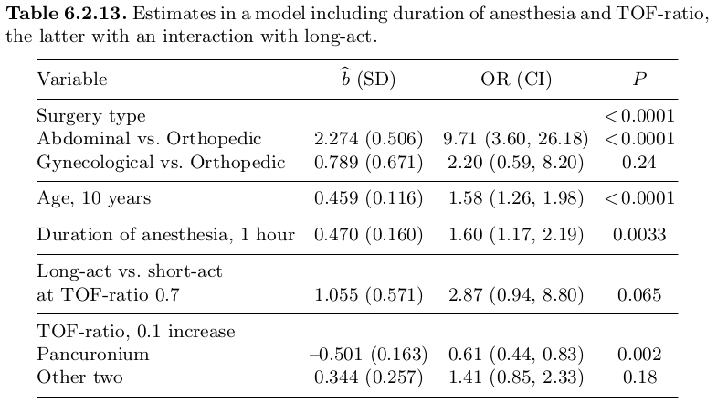
Tabla 6.2.13. Estimaciones en un modelo que incluyen la duración de la anestesia y el índice TOF, este último con una interacción con el efecto prolongado. 

Las parcelas de residuos para este modelo se muestran en la Figura 6.2.10. Observamos una pendiente descendente para los residuos en el grupo de Pancuronium cuando la relación TOF es pequeña y cuando la duración de la anestesia aumenta. Esto sugiere que hemos sobreajustado estos efectos porque observamos menos complicaciones de las esperadas en estas circunstancias que de otro modo se considerarían peligrosas. Sin embargo, como es evidente en la Figura 6.2.10, el efecto se debe a muy pocas observaciones. Como fue el caso del ejemplo en la Sección 6.2.1 anterior, aquí también hicimos gráficos basados ​​en residuos de dejar uno fuera con resultados casi idénticos (no se muestran). 

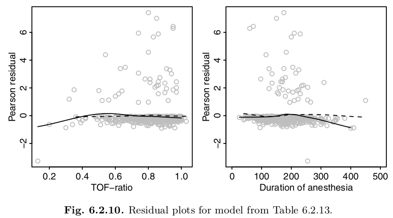

Se puede realizar una prueba de bondad de ajuste general subdividiendo las probabilidades esperadas del modelo final en 10 grupos y comparando el número de complicaciones observadas y esperadas en estos grupos mediante una prueba de chi-cuadrado. Los números observados y esperados se dan en la Tabla 6.2.14. El estadístico de prueba resultante es 3.877, que evaluado en una distribución Chi-cuadrado con 8 grados de libertad da P = 0.87. Esta prueba se conoce como prueba de bondad de ajuste de Hosmer y Lemeshow (Hosmer y Lemeshow, 2000, cap. 5). Tenga en cuenta que puede depender de alguna manera de la categorización precisa en diez grupos y puede implementarse de manera un poco diferente en diferentes programas de estadística. 

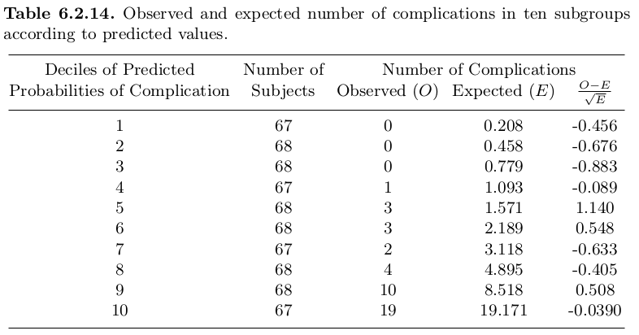
Debido al tamaño relativamente grande del conjunto de datos, no esperamos que una sola observación tenga una gran influencia en los resultados. Sin embargo, investigamos brevemente esto observando un gráfico de la distancia de Cook (esquina superior izquierda de la Figura 6.2.11) y los cambios en los parámetros estimados seleccionados, a saber, para la efecto de la edad, la duración de la anestesia y la interacción entre el índice TOF y el NBA de acción prolongada. Observamos una única observación bastante influyente con un valor de Cook superior a 0,1. Corresponde a un paciente Abdominal de 67 años, con una duración de la anestesia de 255 minutos. A pesar de una relación TOF de sólo 0,13 y del hecho de que se utilizó Pancuronium (el agente bloqueador neuromuscular de acción prolongada), este paciente no experimentó ninguna complicación. Por lo tanto, vemos una gran influencia en el término de interacción (≈1) en la esquina inferior derecha. También observamos que prácticamente todos los sujetos con alguna influencia notable en el efecto estimado de la edad (y la mayoría de los que influyen en el efecto de la duración) son sujetos que experimentan una complicación. Esto se debe a que las complicaciones ocurren con bastante poca frecuencia, por lo que las conclusiones se basan más en ellas que en las no complicaciones. Es posible que queramos tomar la consecuencia del sencillo muy observación influyente y limitar el análisis a los sujetos con un índice TOF por encima, digamos 0,2. Sin embargo, debido a que el índice TOF es una variable intermedia, eso sería cuestionable y tal selección puede conducir a resultados sesgados. Intuitivamente, si el fármaco de acción prolongada conduce a muchos ratios de TOF bajos (con complicaciones) y todos estos se eliminan del conjunto de datos, el fármaco de acción prolongada ya no parecería peligroso. En cambio, la consecuencia de una observación tan influyente debería ser llevar a cabo una investigación más amplia y, por lo tanto, se espera, poder modelar el efecto de la relación TOF de una manera más satisfactoria. 

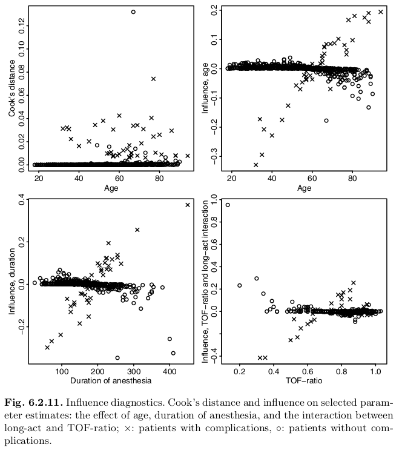

# Conclusión 
Debido a que las verificaciones del modelo y la búsqueda de observaciones influyentes no revelaron problemas drásticos con nuestro modelo, llegamos a la conclusión de que los resultados indicados en la tabla 6.2.13 podrían ser los resultados finales de estos análisis. Las diferencias entre los tres agentes bloqueadores neuromusculares fueron el foco del análisis, por lo que el hallazgo principal es que el Pancuronium aumenta el riesgo de una complicación para los pacientes que tienen un índice de TOF bajo. Si eliminamos el efecto insignificante del TOF-ratio para los fármacos de acción corta, obtenemos estimaciones de odds ratio ligeramente modificadas como se ve en la Tabla 6.2.15. 

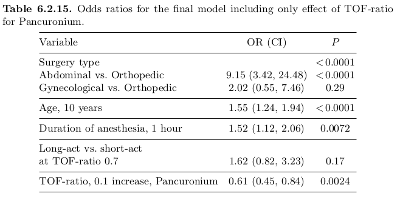
Las seis curvas de la figura 6.2.12 ilustran la probabilidad estimada de una complicación para los tres grupos de cirugía, dos curvas para cada uno según se haya utilizado Pancuronium (el fármaco de acción prolongada). Las probabilidades estimadas se calculan para un paciente de 60 años que se ha sometido a una cirugía durante dos horas y se grafican contra el valor del cociente TOF. Tenga en cuenta que, en correspondencia con los resultados de la tabla 6.2.15, solo las curvas correspondientes al Pancuronium muestran un efecto de la relación TOF. Investigamos si la estructura de esas curvas se vio muy afectada por la observación influyente única y, afortunadamente, resultó no ser el caso. 


```{r}

```


